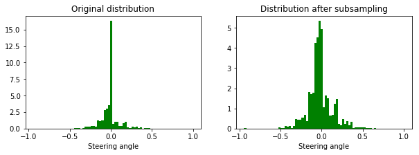
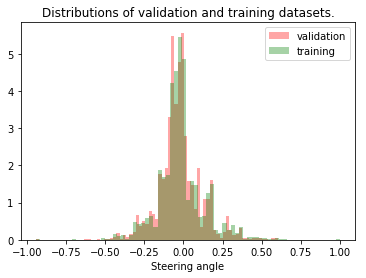
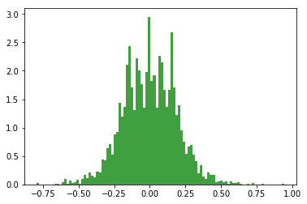
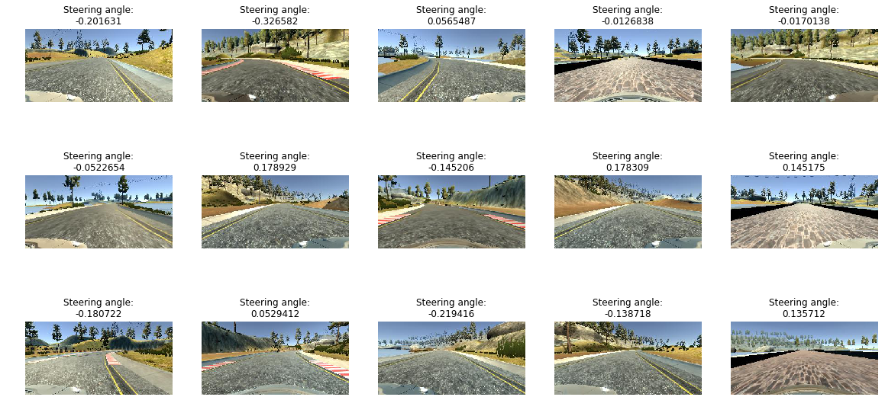
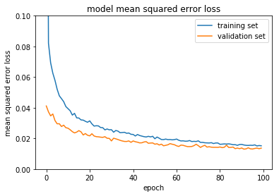
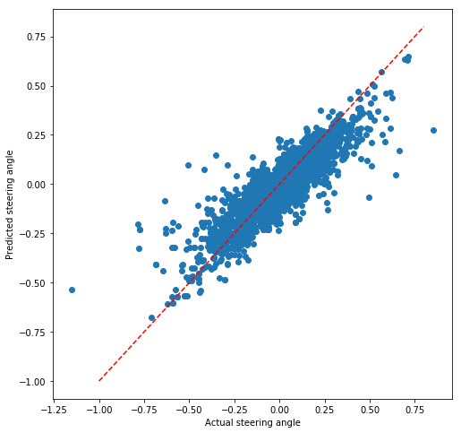

#**Behavioral Cloning Project** 
### Steven De Gryze - April 2017

---

The goals / steps of this project are the following:

* Use the simulator to collect data of good driving behavior
* Build, a convolution neural network in Keras that predicts steering angles from images
* Train and validate the model with a training and validation set
* Test that the model successfully drives around track one without leaving the road
* Summarize the results with a written report

---

## Rubric Points
Here I will consider the [rubric points](https://review.udacity.com/#!/rubrics/432/view) individually and describe how I addressed each point in my implementation.  

###Files Submitted & Code Quality

####1. Submission includes all required files and can be used to run the simulator in autonomous mode

My project includes the following files:
* model.py containing the script to create and train the model
* drive.py for driving the car in autonomous mode
* model.h5 containing a trained convolution neural network 
* writeup.md and writeup.pdf summarizing the results

####2. Submission includes functional code
Using the Udacity provided simulator and my drive.py file, the car can be driven autonomously around the track by executing 
```sh
python drive.py model.h5
```

####3. Submission code is usable and readable

The model.py file contains the code for training and saving the convolution neural network. The file shows the pipeline I used for training and validating the model, and it contains comments to explain how the code works.

###Model Architecture and Training Strategy

####1. An appropriate model architecture has been employed

My model consists of a convolution neural network with 3x3 filter sizes and depths between 32 and 128 (model.py lines 18-24) 

The model includes RELU layers to introduce nonlinearity (code line 20), and the data is normalized in the model using a Keras lambda layer (code line 18). 

####2. Attempts to reduce overfitting in the model

The following devices were used to avoid overfitting:

 * The model contains 2 dropout layers in order to reduce overfitting (model.py lines 21).
 * Instead of early termination, we only saved a model when the validation loss decreased through Keras checkpoints. Therefore, if during training overfitting occurs and the validation loss increases, the overtrained model will not be retained.
 * The model was trained and validated on different data sets to ensure that the model was not overfitting (code line 10-16). The model was tested by running it through the simulator and ensuring that the vehicle could stay on the track.

####3. Model parameter tuning

The model used an adam optimizer. However, I found that it was very important to reduce the default learning rate from 10^-3 to 10^-4 to achieve a robust model. This was done in model.py on line XXX.

####4. Appropriate training data

I added two additional laps of data to the data already provided by udacity. My skills as a simulator drive are certainly less good than the driving skills of the udacity driver. However, by including some data where the care swerved, I also added valuable recovery data which helps to keep the vehicle driving on the road. I used data from all three cameras (applying a correction of + or - 0.15 from the left and right cameras). In addition, I flipped the image horizontally (while negating the steering angle) to double the amount of training data and neutralize the left steering angle bias in the training data due to the counterclockwise track.

For details about how I created the training data, see the next section. 

###Model Architecture and Training Strategy

####1. Solution Design Approach

The overall strategy for deriving a model architecture was to find a model architecture that could clearly overfit a smaller subset of the data (about 1000 images). I started with a similar network as the NVIDIA network presented in the class. With 5 convolutional layers and another 5 fully connected layers, I thought this model was certainly complex enough to fit the data. If anything, I was concerned that there was insufficient training data to fit all the parameters of the model, potentially leading to overfitting. In a next step, I found that removing one fully connected layer (the one with over 1000 neurons) and adding two dropout layers performed equally well or even better on the validation data compared to the original NVIDIA model, but had less parameters, trained faster, and had clearly less risk of overfitting.

In order to gauge how well the model was working, I split my image and steering angle data into a training (80% of original data) and validation set (20% of original data). I found that the original NVIDIA model had a low mean squared error on the training set but a high mean squared error on the validation set. This implied that the model was overfitting. 

To combat the overfitting, I modified the model so that it was slightly simpler by removing the largest fully connected layer. I also added two dropout layers with a dropout probability of 50%.

Then I implemented intermediate saving of the model but only when the validation loss decreased. This is an effective way to avoid overfitting due to excessive training. However, with the two dropout layers, I did not find that my training loss increased with the number of epochs

The final step was to run the simulator to see how well the car was driving around track one. There were a few spots where the vehicle fell off the track. To improve the driving behavior in these cases, I simply increased the number of epochs. Many other students fine-tuned an existing model in these problem spots or added training data specifically for these spots. I found that increasing the number of epochs was sufficient to get the model drive better in these problem areas.

At the end of the process, the vehicle is able to drive autonomously around the track without leaving the road. There are still a few spots where the car is hugging one side of the ride. If I would have more time, I would certainly do some model fine-tuning with subsets of the training data.

####2. Final Model Architecture

The final model architecture (model.py lines 18-24) consisted of a convolution neural network with the following layers and layer sizes ...

Here is a visualization of the architecture (note: visualizing the architecture is optional according to the project rubric)

####3. Creation of the Training Set & Training Process

To capture good driving behavior, I first recorded two laps on track one using center lane driving. My skills as a simulator drive are certainly less good than the driving skills of the udacity driver who generated the data that came with the project. However, by including some data where the care swerved, I also added valuable recovery data which helps to keep the vehicle driving on the road. I found that this was certainly effective.

After the collection process, I had 12585 number of data points. However, after plotting a distribution of the steering_angles, it was clear that (1) the distribution had a large peak around 0, and (2) the distribution was not symmetric and had more points steering left than right due to the track being counter-clockwise. To make a more smooth distribution and reduce the impact of (1), I subsampled only 5% of the images with a steering angle of 0. The following figure shows the distribution of steering angles from my data points before and after the 0 steering angle subsampling.



I then randomly shuffled the data set and put 20% of the data into a validation set and kept 80% in the training dataset. I verified that the distribution of the validation and training datasets were similar as shown in the following graph. 



In my generator function, I further augmented the data set by randomly mirroring images and selecting different camera angles. I mirrored images along the left-right/horizontal axis thinking that this could eliminate the impact of the bias to the left due to the counter-clockwise track. Adding data from different camera angles adds more datapoints at more extreme angles which can really help with recovery when the car is far on the side of the road.

The distribution of the steering angles of the data generated by the generator function, so after random mirroring and selecting a random camera angle looks as following.



Below is a sample of images and their steering angles as they come out of the generator.



I used this generator on the training data for training the model. The validation set helped determine if the model was over or under fitting. I used an adam optimizer. I found that with the default learning rate of 10^-3 with the adam optimizer caused the training loss to be very volatile at times where the training loss would often increase randomly in a peak-like pattern. Therefore, I reduced the learning rate to 10^-4. This slowed down training quite a bit, so I increased the number of epochs. Since I only retain models that improved the validation loss, I set the number of epochs to a really large number, i.e., 200. I found that even after 150 epochs, the validation loss was still decreasing slightly without any evidence of overfitting.



I created a scatterplot of the actual steering angles in the validation dataset vs. the predicted steering angles. I found that the predicted steering angles never became smaller than XXX in comparison to the actual steering angles. There were two outlying points in the validation dataset that were reasonably well captured in the model. However, the slope of the scatter plot was slightly less steep than a 1:1 line, suggesting that there is still room for improvement.



Finally, I also plotted the distributions of the actual and predicted steering angles. They correspond well.


