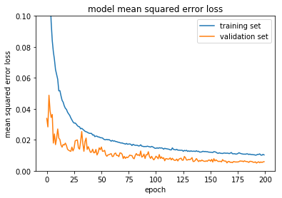

#**Behavioral Cloning Project** 
### Steven De Gryze - April 2017

---

The goals / steps of this project are the following:

* Use the simulator to collect data of good driving behavior
* Build, a convolution neural network in Keras that predicts steering angles from images
* Train and validate the model with a training and validation set
* Test that the model successfully drives around track one without leaving the road
* Summarize the results with a written report

---

## Rubric Points
Here I will consider the [rubric points](https://review.udacity.com/#!/rubrics/432/view) individually and describe how I addressed each point in my implementation.  

###Files Submitted & Code Quality

####1. Submission includes all required files and can be used to run the simulator in autonomous mode

My project includes the following files:
* model.py containing the script to create and train the model
* drive.py for driving the car in autonomous mode
* model.h5 containing a trained convolution neural network 
* writeup.md and writeup.pdf summarizing the results

####2. Submission includes functional code
Using the Udacity provided simulator and my drive.py file, the car can be driven autonomously around the track by executing 
```sh
python drive.py model.h5
```

####3. Submission code is usable and readable

The model.py file contains the code for training and saving the convolution neural network. The file shows the pipeline I used for training and validating the model, and it contains comments to explain how the code works.

###Model Architecture and Training Strategy

####1. An appropriate model architecture has been employed

My model consists of a convolution neural network with 5 convolutional layers (code lines 126-130), 3 with a 5x5 filter and maxpooling (depths 24, 36, and 48), and 2 with a 3x3 filter without maxpooling (depths of 64). The convolutional layers are followed by 4 fully connected layers (code lines 132-137) with depths 100, 50, 10 and 1. The first two fully connected layers have dropout with a probability of 0.5.

Each layer in the model includes an ELU layer to introduce nonlinearity (code line 20), and the data is first normalized in the model using a Keras lambda layer (code line 125). 

####2. Attempts to reduce overfitting in the model

The following approaches were used to avoid overfitting:

 * The model adds dropout in the first 2 fully connected layers (code lines 132 and 134).
 * I implemented early termination through the checkpoints argument, which was set up so that the model was saved to disk only when the validation loss decreased (code line 149). Therefore, if during training overfitting occurs and the validation loss increases, the resulting overtrained model is ignored.
 * The model was trained and validated on different data sets to ensure that the model was not overfitting (code line 10-16). The model was tested by running it through the simulator and ensuring that the vehicle could stay on the track.

####3. Model parameter tuning

The model used an adam optimizer. I found that it was very important to reduce the default learning rate from 10^-3 to 10^-4 to achieve a robust model. This was done in model.py on line 144.

####4. Appropriate training data

I added two additional laps of data to the data already provided by udacity. My skills as a simulator drive are certainly less good than the driving skills of the udacity driver. However, by including some data where the care swerved, I also added valuable recovery data which helps to keep the vehicle driving on the road. I used data from all three cameras (applying a correction of + or - 0.15 from the left and right cameras). In addition, I randomly flipped the image horizontally sometimes (while negating the steering angle) to double the amount of training data and neutralize the left steering angle bias in the training data due to the counterclockwise track.

For details about how I created the training data, see the next section. 

###Model Architecture and Training Strategy

####1. Solution Design Approach

To evaluate different model architectures independently, I split my image and steering angle data into a training (80% of original data) and validation set (20% of original data). I used the found that mean squared error as the loss function.

The overall strategy for deriving a model architecture was to find a model architecture that could clearly overfit a smaller subset of the data (about 1000 images). I started with a similar network as the NVIDIA network presented in the course. With 5 convolutional layers and another 5 fully connected layers, I thought this model was certainly complex enough to fit the data. If anything, I was concerned that there was insufficient training data to fit all the parameters of the model, potentially leading to overfitting. While training, I found that the validation loss was significantly higher than the training loss with the NVIDIA model. In addition, I found that the validation loss increased over time, indicating overfitting. Therefore, in a next step, I removed the first fully connected layer (the one with over 1000 neurons) and adding two dropout layers with a dropout probability of 50%. I found that this model performed equally well on the training data and seemed to be much less susceptible to overfitting as shown by the steady decrease of the validation loss. In addition, this model had less parameters and trained faster.

Furthermore, I implemented early termination by only saving models during training only when the validation loss decreased after the epoch. This is an effective way to avoid overfitting due to excessive training. However, with the two dropout layers, I did not find that my training loss increased with the number of epochs

The final step was to run the simulator to see how well the car was driving around track one. There were a few spots where the vehicle fell off the track. To improve the driving behavior in these cases, I simply increased the number of epochs. Many other students fine-tuned an existing model in these problem spots or added training data specifically for these spots. I found that increasing the number of epochs was sufficient to get the model drive better in these problem areas.

At the end of the process, the vehicle is able to drive autonomously around the track without leaving the road. There are still a few spots where the car is hugging one side of the ride. If I would have more time, I would certainly do some model fine-tuning with subsets of the training data.

####2. Final Model Architecture

The final model architecture (model.py lines 121-138) consisted of a convolution neural network with the following layers and layer sizes:

 * A normalization pass to get the image values between -0.5 and +0.5
 * A convolution layer with 5x5 filter and depth 24, 2x2 maxpooling followed by an ELU activation layer
 * A convolution layer with 5x5 filter and depth 36, 2x2 maxpooling followed by an ELU activation layer
 * A convolution layer with 5x5 filter and depth 48, 2x2 maxpooling followed by an ELU activation layer
 * A convolution layer with 3x3 filter and depth 64, no maxpooling followed by an ELU activation layer
 * A convolution layer with 3x3 filter and depth 64, no maxpooling followed by an ELU activation layer
 * A fully connected layer of width 100 with drop-out on the input, followed by an ELU activation layer
 * A fully connected layer of width 50 with drop-out on the input, followed by an ELU activation layer
 * A fully connected layer of width 10, followed by an ELU activation layer
 * A final fully connected layer of width 1

####3. Creation of the Training Set & Training Process

To capture good driving behavior, I first recorded two additional laps on track one using center lane driving. My skills as a simulator drive are certainly less good than the driving skills of the udacity driver who generated the data that came with the project. However, by including some data where the car swerved, I also added valuable recovery data which helps to keep the vehicle driving on the road. I found that this was very effective. During model testing, I found that the car was adequately able to recover from being on the side of the road.

After the collection process, I had 12585 number of data points with steerin angles ranging from about -1 to +1. Below are the images with the two most extreme angles in my dataset.


The distribution of the steering_angles (1) shows a disproportionately large peak around 0, and (2) is not symmetric around zero and had more points steering left than right due to the track being counter-clockwise. To make a more smooth distribution and reduce the impact of (1), I subsampled only 5% of the images with a steering angle of 0. The following figure shows the distribution of steering angles from my data points before and after the 0 steering angle subsampling.


I then randomly shuffled the data set and put 20% of the data into a validation set and kept 80% in the training dataset. I verified that the distribution of the validation and training datasets were similar by overlaying the histograms. 


In my generator function, I further augmented the data set by randomly mirroring images and selecting different camera angles. I mirrored images along the left-right/horizontal axis thinking that this could eliminate the impact of the bias to the left due to the counter-clockwise track. Adding data from different camera angles adds more datapoints at more extreme angles which can really help with recovery when the car is far on the side of the road.

The distribution of the steering angles of the data generated by the generator function (i.e., after random mirroring and selecting a random camera angle) looks as following.


Below is a sample of images and their steering angles as they come out of the generator.


Subsequently, a generator on the training data was used for training the model. The validation set helped determine if the model was over or under fitting. For training, I used an adam optimizer. I found that with the default learning rate of 10^-3 with the adam optimizer caused the training loss to be very volatile at times where the training loss would often increase randomly in a peak-like pattern. Therefore, I reduced the learning rate from 10^-3 to 10^-4. While this slowed down learning, it made the training loss decrease much more monotonically.



To counteract the slower learning, I also increased the number of epochs. Since I only retain models that improved the validation loss, I set the number of epochs to 200. I found that even after 200 epochs, the validation loss was still decreasing slightly without any evidence of overfitting. Therefore, I could probably have increase the number of epochs even further.


As a visual check of the quality of the resulting final model, I created a scatterplot of the actual steering angles in the validation dataset vs. the predicted steering angles. I found that points followed the 1:1 line quite well. Some more extreme steering angles were less well predicted, but the number of such points was really limited.

Finally, I also plotted the distributions of the actual and predicted steering angles. They correspond well, with the actual steering angle distribution slightly wider than the predicted steering angle. This is to be expected.

